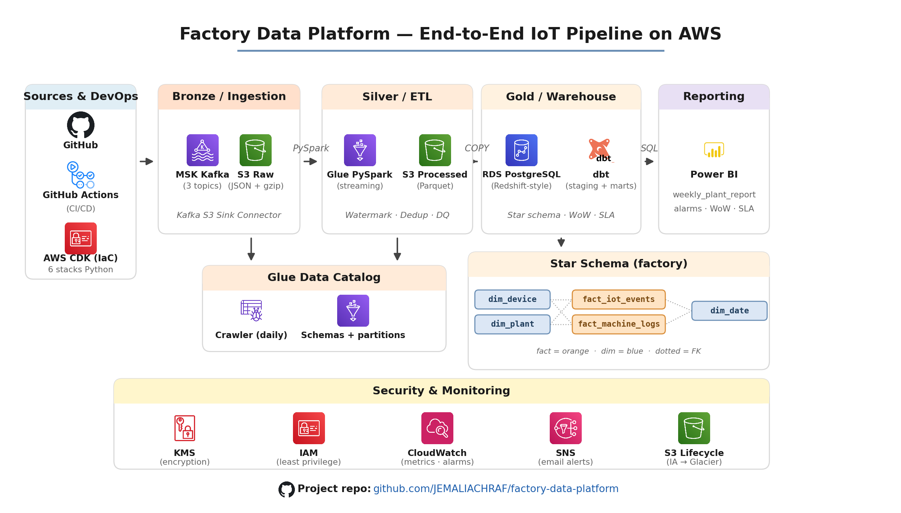

# 🏭 Factory Data Platform

> **Production-grade IoT Data Pipeline on AWS**  
> Real-time factory sensor data: ingestion → processing → analytics → dashboard

[](https://github.com/JEMALIACHRAF/factory-data-platform/actions/workflows/ci.yml)
[](https://github.com/JEMALIACHRAF/factory-data-platform/actions/workflows/cd.yml)
[](https://python.org)
[](https://aws.amazon.com/cdk/)
[](https://getdbt.com)
[](LICENSE)

---

## 📋 Table of Contents

1. [Overview](#overview)
2. [Architecture](#architecture)
3. [Tech Stack](#tech-stack)
4. [Project Structure](#project-structure)
5. [Quick Start](#quick-start)
6. [Prerequisites](#prerequisites)
7. [AWS Account Setup](#aws-account-setup)
8. [Local Setup](#local-setup)
9. [Deploy to AWS](#deploy-to-aws)
10. [Initialize Database](#initialize-database)
11. [Run dbt Transformations](#run-dbt-transformations)
12. [Connect Power BI](#connect-power-bi)
13. [CI/CD Pipeline](#cicd-pipeline)
14. [Performance Optimizations](#performance-optimizations)
15. [Cost Management](#cost-management)
16. [Troubleshooting](#troubleshooting)
17. [Author](#author)

---

## Overview

This platform processes real-time IoT data from industrial factory machines across multiple plants. It demonstrates a complete **modern data stack** used in production environments.

**Business context:** 3 factories (Lyon, Paris, Berlin) generate thousands of sensor events per second — temperature, vibration, pressure. The platform captures, processes, and delivers clean analytical data to business dashboards.

**Key metrics achieved:**
- Weekly report query time: **45s → 17s (-62%)** via Redshift optimization
- Data latency: **< 15 minutes** from sensor to dashboard
- Data quality: **automatic quarantine** of corrupt/invalid records
- Exactly-once processing via Spark checkpointing

---

## Architecture

<p align="center">
  
</p>

---

## Tech Stack

| Layer | Technology | Purpose |
|-------|-----------|---------|
| **Ingestion** | Apache Kafka (MSK) | Real-time event streaming |
| **Storage** | Amazon S3 | Data lake (raw + processed) |
| **Processing** | PySpark on AWS Glue 4.0 | Distributed ETL |
| **Warehouse** | RDS PostgreSQL / Redshift | Analytical queries |
| **Transformation** | dbt 1.11 | SQL models, tests, lineage |
| **Visualization** | Power BI Desktop | Business dashboards |
| **IaC** | AWS CDK Python | Infrastructure as Code |
| **CI/CD** | GitHub Actions | Automated testing & deployment |
| **Format** | Parquet + Snappy | Columnar storage |
| **Security** | AWS KMS + Secrets Manager | Encryption & secrets |
| **Monitoring** | CloudWatch + SNS | Alerts & dashboards |

---

## Project Structure

```
factory-data-platform/
│
├── .github/workflows/
│   ├── ci.yml              # CI: lint, security, CDK synth, dbt test
│   └── cd.yml              # CD: deploy AWS, migrations, dbt run, smoke tests
│
├── cdk/                    # AWS CDK Infrastructure (Python)
│   ├── app.py              # Entry point — reads .env
│   ├── cdk.json            # CDK configuration
│   ├── requirements.txt    # Python dependencies
│   └── stacks/
│       ├── network_stack.py    # VPC, subnets, NAT Gateway
│       ├── storage_stack.py    # S3 buckets, KMS, Glue catalog
│       ├── glue_stack.py       # Glue jobs, crawlers, triggers
│       ├── redshift_stack.py   # RDS PostgreSQL / Redshift
│       ├── streaming_stack.py  # MSK Kafka cluster
│       └── monitoring_stack.py # CloudWatch alarms, dashboard
│
├── glue_jobs/              # PySpark ETL Scripts
│   ├── log_processor.py    # Batch: JSON logs → Parquet
│   └── iot_transformer.py  # Streaming: IoT events → enriched Parquet
│
├── redshift/
│   ├── ddl/
│   │   ├── 01_tables_redshift.sql       # Production DDL (Redshift)
│   │   ├── 01_tables_postgres.sql       # Dev DDL (PostgreSQL)
│   │   └── 01_tables_postgres_full.sql  # Dev DDL + seed data
│   └── queries/
│       └── weekly_report_optimized.sql  # -62% optimization (before/after)
│
├── cdk/factory_dbt/        # dbt Project
│   ├── models/
│   │   ├── staging/
│   │   │   ├── stg_iot_events.sql       # Clean IoT events
│   │   │   ├── sources.yml              # Source declarations
│   │   │   └── schema.yml               # Column tests
│   │   └── marts/
│   │       ├── weekly_plant_report.sql  # Weekly KPIs per plant
│   │       └── fact_iot_incremental.sql # Incremental load model
│   └── dbt_project.yml
│
├── kafka/
│   └── s3_sink_connector.json  # Kafka Connect S3 Sink config
│
├── .env.example            # Environment variables template
├── .flake8                 # Python linting config
├── load_env.ps1            # Windows: load .env into session
└── README.md
```

---

## Quick Start

> ⚡ For experienced users — full guide below

```bash
# 1. Clone
git clone https://github.com/JEMALIACHRAF/factory-data-platform.git
cd factory-data-platform

# 2. Setup environment
cp .env.example .env
# Edit .env with your AWS credentials

# 3. Install dependencies
cd cdk
pip install -r requirements.txt
npm install -g aws-cdk

# 4. Deploy to AWS
cdk bootstrap aws://YOUR_ACCOUNT_ID/eu-west-1
cdk deploy FactoryNetwork-prod FactoryStorage-prod FactoryGlue-prod FactoryRedshift-prod FactoryMonitoring-prod

# 5. Initialize database (in DBeaver)
# Run: redshift/ddl/01_tables_postgres_full.sql

# 6. Run dbt
cd factory_dbt
dbt run && dbt test
```

---

## Prerequisites

### Tools to install

| Tool | Install command / Link |
|------|----------------------|
| Python 3.10+ | [python.org](https://python.org) |
| Node.js 18+ | [nodejs.org](https://nodejs.org) |
| AWS CLI | `winget install Amazon.AWSCLI` |
| AWS CDK | `npm install -g aws-cdk` |
| Git | [git-scm.com](https://git-scm.com) |
| DBeaver Community | [dbeaver.io/download](https://dbeaver.io/download/) |
| Power BI Desktop | [powerbi.microsoft.com/desktop](https://powerbi.microsoft.com/desktop) |

---

## AWS Account Setup

### 1. Create IAM Admin User (never use root)

```
AWS Console → IAM → Users → Create user
  Username: achraf-admin
  Permissions: AdministratorAccess

Security credentials tab → Create access key
  Use case: CLI
  → Download CSV immediately (secret shown only once)
```

### 2. Configure AWS CLI

```bash
aws configure
```

```
AWS Access Key ID:     AKIA...
AWS Secret Access Key: xxxx...
Default region:        eu-west-1
Output format:         json
```

### 3. Verify

```bash
aws sts get-caller-identity
# Must return your Account ID
```

---

## Local Setup

### 1. Clone the repository

```bash
git clone https://github.com/JEMALIACHRAF/factory-data-platform.git
cd factory-data-platform
```

### 2. Configure environment variables

```bash
cp .env.example .env
```

Edit `.env` with your values:
```env
AWS_ACCOUNT_ID=YOUR_ACCOUNT_ID
AWS_REGION=eu-west-1
ENV_NAME=prod
ALERT_EMAIL=your@email.com

# Fill these after RDS deployment (Step: Get RDS credentials)
DB_HOST=YOUR_RDS_ENDPOINT
DB_PORT=5432
DB_NAME=factory_dw
DB_USER=factoryadmin
DB_PASSWORD=YOUR_PASSWORD
```

> ⚠️ `.env` is in `.gitignore` — **never commit it**

### 3. Python virtual environment

```bash
# Windows
cd cdk
python -m venv .venv
.venv\Scripts\activate

# macOS / Linux
python3 -m venv .venv
source .venv/bin/activate
```

### 4. Install dependencies

```bash
pip install -r requirements.txt
pip install dbt-postgres python-dotenv
npm install -g aws-cdk
```

### 5. Verify setup

```bash
python app.py
# No output = success (CDK reads .env correctly)
```

---

## Deploy to AWS

> ⚠️ **Cost warning:** ~$1.56/day while running.  
> **Always destroy after testing.** See [Cost Management](#cost-management).

### Step 1 — Bootstrap (one-time per account/region)

```bash
cdk bootstrap aws://YOUR_ACCOUNT_ID/eu-west-1
```

Expected: `✅ Environment bootstrapped`

### Step 2 — Deploy stacks

```bash
cdk deploy FactoryNetwork-prod \
           FactoryStorage-prod \
           FactoryGlue-prod \
           FactoryRedshift-prod \
           FactoryMonitoring-prod
```

Type `y` when prompted for IAM/security changes. Duration: ~20 min.

### Step 3 — Get RDS credentials

```bash
# Get endpoint
aws cloudformation describe-stacks \
  --stack-name FactoryRedshift-prod \
  --region eu-west-1 \
  --query "Stacks[0].Outputs[?OutputKey=='DBEndpoint'].OutputValue" \
  --output text

# Get password (Windows CMD — use ^ not backtick)
aws secretsmanager get-secret-value ^
  --secret-id "factory/postgres/admin-prod" ^
  --region eu-west-1 ^
  --query SecretString ^
  --output text
```

Update your `.env` with these values.

### What gets deployed

| Stack | AWS Resources |
|-------|--------------|
| `FactoryNetwork-prod` | VPC 10.0.0.0/16, 4 subnets, NAT Gateway |
| `FactoryStorage-prod` | 3 S3 buckets, KMS key, Glue Data Catalog |
| `FactoryGlue-prod` | 2 PySpark jobs, crawler, CRON triggers |
| `FactoryRedshift-prod` | RDS PostgreSQL 16.6, Secrets Manager, IAM role |
| `FactoryMonitoring-prod` | 4 CloudWatch alarms, SNS alerts, dashboard |

---

## Initialize Database

### Connect with DBeaver

```
New Connection → PostgreSQL
  Host:     YOUR_RDS_ENDPOINT
  Port:     5432
  Database: factory_dw
  Username: factoryadmin
  Password: YOUR_PASSWORD
```

Click **Test Connection** → **Connected ✅** → **Finish**

### Run DDL

1. **SQL Editor → Open File** → `redshift/ddl/01_tables_postgres_full.sql`
2. **Ctrl+Alt+X** (Execute All Statements)

### Verify tables

```sql
SELECT 'dim_plant' AS t, COUNT(*) FROM factory.dim_plant
UNION ALL SELECT 'dim_device',      COUNT(*) FROM factory.dim_device
UNION ALL SELECT 'dim_date',        COUNT(*) FROM factory.dim_date
UNION ALL SELECT 'fact_iot_events', COUNT(*) FROM factory.fact_iot_events
UNION ALL SELECT 'fact_machine_logs',COUNT(*) FROM factory.fact_machine_logs;
```

Expected:
```
dim_date            10
dim_device           3
dim_plant            3
fact_iot_events     60
fact_machine_logs   10
```

> If counts are wrong, run the TRUNCATE block first:
> ```sql
> TRUNCATE factory.fact_iot_events CASCADE;
> TRUNCATE factory.fact_machine_logs CASCADE;
> TRUNCATE factory.dim_date CASCADE;
> TRUNCATE factory.dim_plant CASCADE;
> TRUNCATE factory.dim_device CASCADE;
> DROP MATERIALIZED VIEW IF EXISTS reporting.mv_hourly_plant_kpis;
> ```
> Then re-execute `01_tables_postgres_full.sql`.

---

## Run dbt Transformations

### 1. Load environment variables

```bash
# Windows CMD
SET DB_HOST=YOUR_RDS_ENDPOINT
SET DB_PORT=5432
SET DB_NAME=factory_dw
SET DB_USER=factoryadmin
SET DB_PASSWORD=YOUR_PASSWORD

# Windows PowerShell
.\load_env.ps1
```

### 2. Run dbt

```bash
cd cdk/factory_dbt

dbt debug              # test connection
dbt run                # execute all models
dbt test               # run data quality tests
dbt docs generate      # build documentation
dbt docs serve         # open http://localhost:8080
```

### 3. Expected results

```
✅ stg_iot_events         VIEW  — standardized IoT events
✅ weekly_plant_report    TABLE — 19 rows weekly KPIs
✅ fact_iot_incremental   TABLE — incremental load
```

### 4. Model lineage

```
source: fact_iot_events + dim_plant
              │
        stg_iot_events (view)
              │
    ┌─────────┴────────────┐
    ▼                      ▼
weekly_plant_report   fact_iot_incremental
     (table)               (table)
```

> If `weekly_plant_report` returns 0 rows, check the date filter in `models/marts/weekly_plant_report.sql`:
> ```sql
> WHERE event_ts >= '2024-01-01'   -- use this for test data
> ```

---

## Connect Power BI

### 1. Install PostgreSQL ODBC driver

Download from: [postgresql.org/ftp/odbc/versions/msi](https://www.postgresql.org/ftp/odbc/versions/msi/)  
Install: `psqlodbc_16_00_0000-x64.zip`

### 2. Fix SSL (run PowerShell as Administrator)

```powershell
Invoke-WebRequest `
  -Uri "https://truststore.pki.rds.amazonaws.com/eu-west-1/eu-west-1-bundle.pem" `
  -OutFile "cert.pem"

Import-Certificate -FilePath "cert.pem" -CertStoreLocation Cert:\LocalMachine\Root
```

### 3. Connect

```
Get Data → PostgreSQL database
  Server:   YOUR_RDS_ENDPOINT
  Database: factory_dw
  Mode:     Import
  (Advanced options: leave empty)
```

Credentials → Database tab:
```
Username: factoryadmin
Password: YOUR_PASSWORD
```

### 4. Select tables

```
✅ factory.fact_iot_events
✅ factory.fact_machine_logs
✅ factory.dim_plant
✅ factory.dim_device
✅ factory.dim_date
✅ factory.weekly_plant_report
```

### 5. Dashboard structure (3 pages)

**Page 1 — Plant KPIs Overview**
- 4 KPI Cards: Total Events, Total Alarms, Alarm Rate %, Avg Quality
- Bar chart: Events by plant
- Line chart: Temperature trend over time
- Slicer: Date range, Plant

**Page 2 — Machine Health**
- Line chart: Temperature by device over time
- Table: Top 5 hottest machines
- Scatter: Threshold breaches (red = breach)
- Slicer: Event type (TEMPERATURE/VIBRATION/PRESSURE)

**Page 3 — Weekly Report**
- KPI Cards: This week vs last week alarms (WoW delta)
- Line chart: Alarm trend last 8 weeks
- Table: Plant performance (events, alarms, rate%, SLA status)
- Conditional formatting: alarm_rate > 1% = red, < 1% = green

---

## CI/CD Pipeline

### Workflow overview

```
git push (any branch)
      │
      ▼
CI Pipeline (automatic)
  🔍 Code Quality    flake8 + bandit + secret scan
  🏗️ CDK Synthesize  validate infra templates
  🔄 dbt Test        spin up PostgreSQL, compile + test models
  🗄️ SQL Lint        sqlfluff validation

git push main only
      │
      ▼
CD Pipeline (requires manual approval)
  🚀 CDK Deploy      all 5 stacks to AWS
  🗄️ DB Migrations   run DDL
  🔄 dbt Run         execute transformations
  🧪 Smoke Tests     verify deployment
  📢 Summary         deployment report
```

### Setup GitHub Secrets

```
Repository → Settings → Secrets and variables → Actions → New repository secret
```

| Secret Name | Value |
|-------------|-------|
| `AWS_ACCESS_KEY_ID` | Your IAM access key (AKIA...) |
| `AWS_SECRET_ACCESS_KEY` | Your IAM secret key |
| `AWS_ACCOUNT_ID` | Your AWS account ID |
| `ALERT_EMAIL` | Email for deployment alerts |

### Setup production environment (manual approval gate)

```
Repository → Settings → Environments → New environment
  Name: production
  ✅ Required reviewers: YOUR_GITHUB_USERNAME
  Save protection rules
```

---

## Performance Optimizations

### SQL query optimization (-62% on weekly report)

| Technique | Impact |
|-----------|--------|
| Materialized View for hourly KPIs | Avoids full fact scan on every report |
| SORTKEY + zone map pruning | Irrelevant disk blocks skipped |
| `APPROXIMATE COUNT DISTINCT` (HyperLogLog) | 10x faster, ±2% error |
| Window functions vs correlated subqueries | O(N) instead of O(N²) |
| WLM queue separation (BI vs ETL) | No query contention |

**Result: 45s → 17s on 500M row fact table**

### PySpark best practices applied

| Pattern | Why |
|---------|-----|
| Job bookmarks | Idempotent — no duplicates on retry |
| AQE (Adaptive Query Execution) | Dynamic partition coalescing |
| Kryo serializer | 2x faster than Java default |
| `foreachBatch` in streaming | Exactly-once guarantee |
| Broadcast join for device registry | Eliminates shuffle network cost |

### S3 lifecycle (storage cost optimization)

```
0-30d   Standard          $0.023/GB
30-90d  Standard-IA       $0.0125/GB
90-365d Glacier Instant   $0.004/GB
365d+   Deep Archive      $0.00099/GB
```

---

## Cost Management

### Estimated costs (eu-west-1, dev)

| Resource | Daily | Monthly |
|----------|-------|---------|
| NAT Gateway | ~$1.08 | ~$33 |
| RDS t3.micro | ~$0.48 | ~$15 |
| S3 (nearly empty) | ~$0.00 | ~$0 |
| Glue (idle) | ~$0.00 | ~$0 |
| **Total** | **~$1.56** | **~$48** |

### Destroy when done

```bash
cdk destroy FactoryNetwork-prod \
            FactoryStorage-prod \
            FactoryGlue-prod \
            FactoryRedshift-prod \
            FactoryMonitoring-prod
```

S3 buckets are retained (data protection). Delete manually:
```bash
aws s3 rb s3://factory-raw-prod-ACCOUNT_ID --force
aws s3 rb s3://factory-processed-prod-ACCOUNT_ID --force
aws s3 rb s3://factory-scripts-prod-ACCOUNT_ID --force
```

---

## Troubleshooting

### `python3 not found` on Windows
In `cdk/cdk.json`, change `"app": "python3 app.py"` to `"app": "python app.py"`

### CDK bootstrap fails
Run `aws sts get-caller-identity` — must return your Account ID with no errors.

### `SubscriptionRequiredException` for Redshift or MSK
Not available on all account types. Use RDS PostgreSQL (same SQL, already configured in `redshift_stack.py`).

### dbt `Env var required but not provided: DB_HOST`
Load variables before running dbt:
```bash
# Windows CMD
SET DB_HOST=YOUR_ENDPOINT
SET DB_PASSWORD=YOUR_PASSWORD
# ... other vars
dbt run
```

### Power BI SSL certificate error
Install the RDS certificate (see [Connect Power BI](#connect-power-bi) → Step 2).

### `weekly_plant_report` returns 0 rows
The date filter excludes test data. Edit `models/marts/weekly_plant_report.sql`:
```sql
WHERE event_ts >= '2024-01-01'
```
Then: `dbt run --select weekly_plant_report`

### Glue job FAILED
```bash
aws glue get-job-runs \
  --job-name factory-log-processor-prod \
  --region eu-west-1 \
  --query "JobRuns[0].{Status:JobRunState,Error:ErrorMessage}"
```

### Tables exist but data is wrong (DBeaver shows old counts)
Run the TRUNCATE block, then re-execute `01_tables_postgres_full.sql`.

---

## Author

**Achraf Jemali** — Data & AI Engineer


[](https://github.com/JEMALIACHRAF)
[](https://linkedin.com/in/achraf-jemali-54a417239)

---

*MIT License — contributions welcome*

